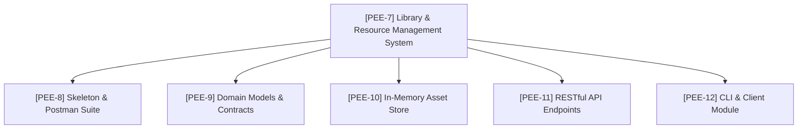

# PEE-7: Library & Resource Management System (Question 1)

## 1. System Overview
**Epic**: [PEE-7] Question 1 – Library & Resource Management System  
**Lead Team**: Peer Pressure (`key: PEE`)  
**Technology Stack**: Ballerina Swan Lake (2201.13.x), Postman Local Mode (v3 YAML)

The Library & Resource Management System is a distributed, RESTful microservice and CLI application engineered for educational and faculty asset administration. It allows institutions to track institutional assets (books, lab equipment, computing hardware, media devices), inspect maintenance schedules, attach modular components, dispatch actionable work orders, and query overdue maintenance.

---

## 2. Subtask Breakdown & Roadmap

1. **PEE-8**: Ballerina project structure, environment configuration, and Postman v3 YAML test suite.
2. **PEE-9**: Canonical domain models, union types (`AssetStatus`, `WorkOrderStatus`), and ISO date validation.
3. **PEE-10**: Isolated, lock-guarded in-memory table store with sub-resource management and concurrency safety.
4. **PEE-11**: Complete REST API resource methods bridging HTTP requests to store operations.
5. **PEE-12**: Interactive command-line interface and reusable HTTP client library.

---

## 3. REST API Specification

| HTTP Method | Resource Path | Description | Status Codes |
| :--- | :--- | :--- | :--- |
| `GET` | `/` | API catalog and route discovery | `200 OK` |
| `GET` | `/health` | Service health status and timestamp | `200 OK` |
| `GET` | `/assets` | Retrieve all assets (with optional `institution` and `site` query parameters) | `200 OK` |
| `POST` | `/assets` | Create a new asset record | `201 Created`, `400 Bad Request` |
| `GET` | `/assets/{assetTag}` | Retrieve an asset by unique `assetTag` | `200 OK`, `404 Not Found` |
| `PUT` | `/assets/{assetTag}` | Update asset attributes and metadata | `200 OK`, `404 Not Found` |
| `DELETE` | `/assets/{assetTag}` | Permanently delete asset record | `200 OK`, `204 No Content`, `404 Not Found` |
| `GET` | `/assets/{assetTag}/status` | Retrieve status, booking, and active work orders summary | `200 OK`, `404 Not Found` |
| `GET` | `/assets/overdue` | Query assets with overdue maintenance schedules | `200 OK` |
| `POST` | `/assets/{assetTag}/components` | Attach a component sub-resource to an asset | `201 Created`, `400 Bad Request`, `404 Not Found` |
| `DELETE` | `/assets/{assetTag}/components/{compId}` | Remove a component sub-resource from an asset | `200 OK`, `204 No Content`, `404 Not Found` |
| `POST` | `/assets/{assetTag}/schedules` | Attach a schedule sub-resource to an asset | `201 Created`, `400 Bad Request`, `404 Not Found` |
| `DELETE` | `/assets/{assetTag}/schedules/{scheduleId}` | Remove a schedule sub-resource from an asset | `200 OK`, `204 No Content`, `404 Not Found` |
| `POST` | `/assets/{assetTag}/work-orders` | Create a maintenance work order with checklist tasks | `201 Created`, `400 Bad Request`, `404 Not Found` |
| `PUT` | `/assets/{assetTag}/work-orders/{orderId}` | Update work order status and task completion states | `200 OK`, `400 Bad Request`, `404 Not Found` |

---

## 4. Key Design Decisions

1. **Asset Tag Identifier Standard**: `assetTag` is enforced consistently across URL paths, JSON properties, and record fields.
2. **Immutability across Lock Boundaries**: All objects entering or leaving `AssetStore` use `.cloneReadOnly()` to ensure complete data isolation across concurrently executing worker threads.
3. **Status Code Semantics**: Proper HTTP semantics (`201` for creation, `200`/`204` for deletion/updates, `404` for missing entities, `400` for invalid payloads or duplicate keys).
4. **Clean Code & Modularity**: Domain records reside in `modules/models`, storage logic in `modules/store`, REST resources in `q1_library_service`, and client/CLI utilities in the dedicated `q1_library_client` package.

---

## 5. Verification & Testing Strategy

- **Unit & Concurrency Tests**: Run locally via `bal test` covering model validation, store concurrency, and service endpoints.
- **Postman API Suite**: 16 automated requests in Local Mode v3 YAML verifying status codes, camelCase key contracts, and end-to-end entity lifecycles.
- **Static Analysis & Formatting**: Verified via `bal format --dry-run` and `bal build`.
