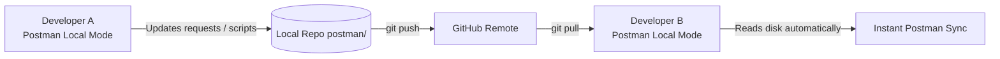

# Postman Team Collaboration Guide: Zero-Cost Git Sync (Local Mode)

> **Target Team**: PeerPressure  
> **Topic**: API Testing, Collection Synchronisation & Git Workflow  
> **Cost**: $0 (No Postman Cloud Subscription Required)

---

## 1. Overview & Motivation

Our team collaborates on REST API endpoints, automated test suites, and environment variables without needing a paid Postman Cloud team subscription or running into cloud seat/collection limits.

By utilising **Postman Local Mode (v12+) and Native Git Version Control (v3 YAML format)**, all Postman requests, tests, scripts, and environment parameters live directly inside our Git repository (`DSA-Assignment`).



---

## 2. Key Advantages

1. **Zero Cost & Unlimited Members**: No need to subscribe or manage cloud seats. Any team member who clones the repository has full access.
2. **True Git Version Control**: Changes to endpoints, headers, test scripts, and parameters are committed, branched, and code-reviewed via Pull Requests like standard code.
3. **Instant Local Sync**: When you run `git pull`, Postman reads the updated files directly from disk without manual import/export steps.
4. **No Giant Merge Conflicts**: Postman v3 format breaks collections down into individual `.request.yaml` files instead of a single giant monolithic JSON file.

---

## 3. Directory Layout in the Repository

All team testing files are located under the `postman/` root folder:

```text
postman/
├── collections/
│   └── q1-library-management/
│       ├── definition.yaml               # $kind: collection metadata
│       └── <endpoint-name>.request.yaml  # $kind: http-request files with markdown docs & scripts
└── environments/
    ├── peerpressure-dev.environment.yaml   # Shared Dev environment variables
    └── peerpressure-local.environment.yaml # Shared Local environment variables
```

---

## 4. Postman v3 YAML Schema Invariants

### 1. Request Files (`<name>.request.yaml`)
Every request file MUST specify `$kind: http-request` at the top and format payloads using `body.content` with multi-line literal blocks (`|-`):

```yaml
$kind: http-request
name: 04. Create Asset
method: POST
url: "{{base_url}}:{{port}}/assets"
headers:
  - key: Content-Type
    value: application/json
  - key: Accept
    value: application/json
body:
  type: json
  content: |-
    {
      "assetTag": "TAG-TEST-001",
      "name": "Introduction to Distributed Systems",
      "status": "AVAILABLE"
    }
description: |-
  ### Endpoint Overview
  Registers a new educational asset into the in-memory repository.
scripts:
  - type: afterResponse
    code: |-
      pm.test("Status code is 201 or 200", function () {
          pm.expect(pm.response.code).to.be.oneOf([200, 201]);
      });
      pm.test("Captured assetTag in camelCase", function () {
          var json = pm.response.json();
          pm.expect(json).to.have.property("assetTag");
          pm.environment.set("assetTag", json.assetTag);
      });
```

### 2. Query Parameters Synchronisation (`FMT209`)
When specifying `queryParams`, the query string in `url` MUST match the `queryParams` definition:

```yaml
$kind: http-request
name: 07. Filter Assets by Institution & Site
method: GET
url: "{{base_url}}:{{port}}/assets?institution=Ministry of Higher Education&site=Main Campus Library"
queryParams:
  - key: institution
    value: Ministry of Higher Education
  - key: site
    value: Main Campus Library
```

### 3. Environment Files
Environment files must specify `name` and `values` without a `$kind` header:

```yaml
name: PeerPressure Dev
values:
  - key: base_url
    value: http://localhost
    enabled: true
  - key: port
    value: "9090"
    enabled: true
  - key: assetTag
    value: TAG-TEST-001
    enabled: true
```

---

## 5. Developer Setup & Workflow

### Step 1: Open Local Workspace in Postman
1. Open Postman Desktop (version 12 or newer).
2. Click the workspace dropdown in the top-left corner and select **Local Mode** or **Open Local Folder**.
3. Choose the root repository folder (`DSA-Assignment`).
4. Postman automatically discovers and displays the collections and environments.

### Step 2: Use Parametrised Variables
Never hardcode URLs or ports in request URLs. Always use double curly braces:
- `{{base_url}}:{{port}}/assets`
- `{{base_url}}:{{port}}/assets/{{assetTag}}`

---

## 6. Running Collections via CLI & CI

You can execute the entire test suite locally in your terminal or in CI pipelines using the Postman CLI:

```powershell
# Run the collection against the shared YAML environment
postman collection run postman/collections/q1-library-management -e postman/environments/peerpressure-dev.environment.yaml

# Run with dynamic variable overrides
postman collection run postman/collections/q1-library-management -e postman/environments/peerpressure-dev.environment.yaml --env-var "port=9095"
```
